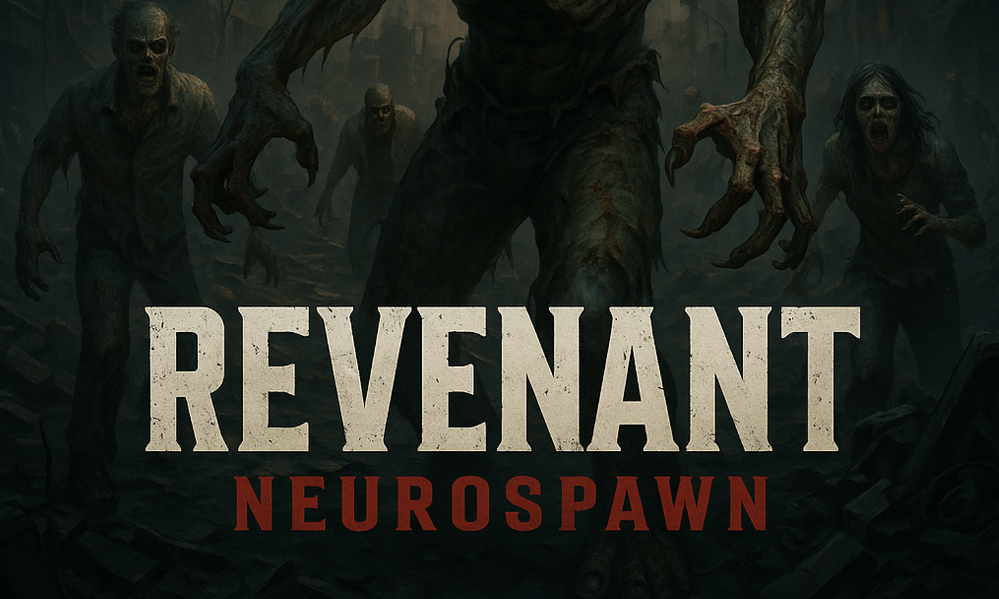
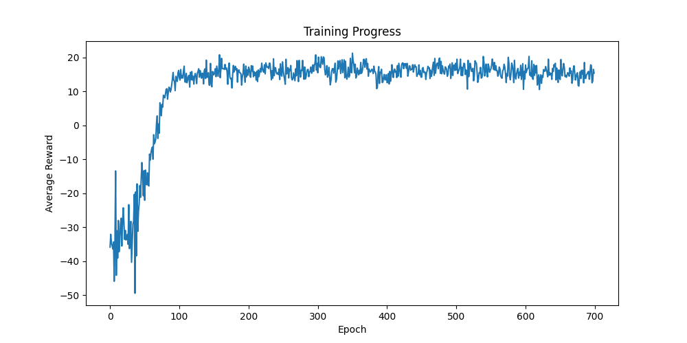

<h1 align="center">Revenant NeuroSpawn</h1>

  

## Overview

Revenant NeuroSpawn is a deep RL-powered zombie spawner for shooter game engineered to make intelligent spawn decisions.

## Key Features

- **State Simulation:** Custom environment simulates player health, position, zombie activity, spawn point distances, and time since last spawn for realistic agent training.
- **Running Normalizer:** Continuously updates and normalizes game state inputs, ensuring stable RL training and generalization across varied scenarios.
- **Strategic Reward Function:** Encourages intelligent spawning—avoiding overwhelming the player, using distant spawns when health is low, and promoting diverse spawn locations when conditions are favorable.
- **Actionable RL Training:** Trained using policy gradients with entropy regularization and learning rate scheduling for stable convergence and diverse behaviors.
- **Performance Visualization:**  
  

    
  

## Neural Network Architecture

- **Input:** Normalized state vector of size 11 (player health, position (x, y, z), zombies active, 5 spawn point distances, time since last spawn).
- **Shared Layers:**  
  - Linear (11 → 256), LayerNorm, ReLU  
  - Linear (256 → 256), LayerNorm, ReLU  
  - Linear (256 → 128), ReLU  
- **Spawn Point Heads:** For each of the 5 spawn points:
  - Linear (128 → 64), ReLU  
  - Linear (64 → 4) — logits for spawning 0, 1, 2, or 3 zombies  
- **Output:** Tensor (batch_size, 5, 4) — action logits for each spawn point.

This architecture enables the agent to learn both global context and specialized spawning strategies, resulting in dynamic, context-aware zombie spawning and an engaging player experience.
